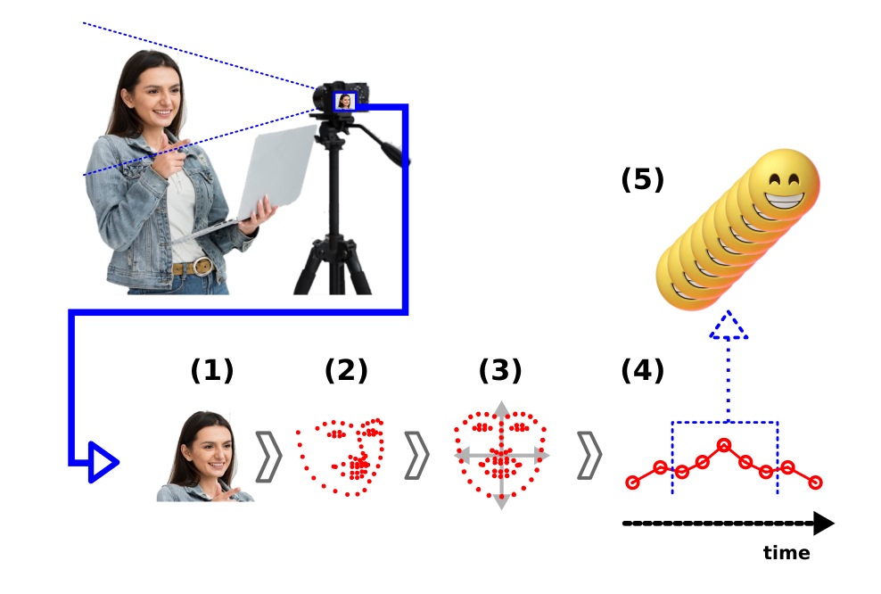

# Biosignals Time Series Dataset

This repository aims to present the development of research in computer vision and information processing applied to the detection of human biosignals. As a first milestone, the proposal and development of a dataset are presented to enable the training of neural networks from signal signatures in time series.

## Research Objective

To perform the extraction, analysis, and interpretation of human biosignals using a technological route that standardizes visual acquisition via video cameras in normalized measures that describe behavior signatures from multivariate time series.

## Introduction

In the context of video image processing, the conventional technological route is presented in Figure 1 by flow 1. This approach is the most used because it focuses on multilayer detection and the use of neural networks in the image domain. On the other hand, this research addresses another route, 2, which creates computational structures that extract and normalize the information of interest and perform analyses in the domain of time series.

  
  
Figure 1 - Approach 1 deals with neural networks in the image domain and 2 focuses on neural network processing in the domain of multivariate time series.

## Proposal of computational system

In general terms, the ideal computational solution in the approach presented above would have the following functionalities as listed below, enumerated according to Figure 2:

1. Detect and crop the human face in the image, separating it from other elements in the scene.
2. Identify the points of interest that describe the face.
3. Calibrate, normalize and standardize observations to generate measurable and comparable criteria.
4. Extract measurements from spatial and temporal descriptors, and generate multivariate time series.
5. Perform analyses, cross-links, and correlations with real-world events.

  
  
Figure 2 - Functionalities and requirements of the proposed computational system.

## Dataset Generation Flow

The first principle for this previously mentioned proposal to become feasible is the availability of time series data extracted from videos with diverse conditions. Thus, it is necessary to have organized datasets that represent various classes of possibilities that enable the training of the neural networks necessary to meet the functionalities presented in Figure 2.

For the constitution of the dataset, the following stages were listed:

1. Generation of Raw Data, performed from the extraction, normalization, and measurements flow via data from videos in public sources;
2. Labeling and Qualification, through the search for similarities from previously cataloged reference seeds;

In Figure 3 below, the main modules comprising the two stages (A and B) are indicated.

  
  
Figure 3 - Dataset Stages, A represents the raw data generation and B the Labeling and Qualification flow.

For a more detailed description of each block:

- [Data generation flow](./blocks_description.md#Windows)

## How to install

- [Installation guide for **Windows**](./how_to_install.md#windows)
- [Installation guide for **Linux**](./how_to_install.md#linux)

## How to run the application

If you want to **just run the application** and see how it works:

- [Run the application guide](./how_to_use.md#Run/\the\/application/\guide)

If you want to **use your own** source of videos:

- [Do it your self guide](./how_to_use.md#Do/\it\/your/\self/\guide)

## Future Developments

- Automatic Labeler L2: It performs a similarity search disregarding the temporal effect. For example, two series may have different durations, but if they exhibit the same behavior, they should be considered similar.
- Inference Models: Create neural network models trained from the labeled dataset.

## Points for Improvement

Spatial and Temporal Normalizer: Further improve aspects with low image quality.

## References

[ARTIGO CBA]

[ARTIGO IEEE]

[OUTRAS]